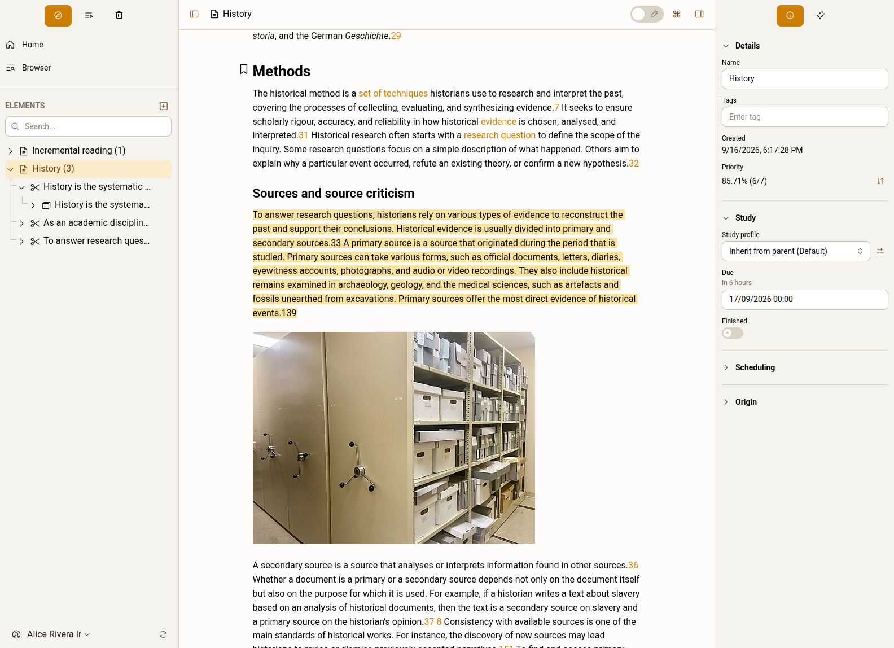
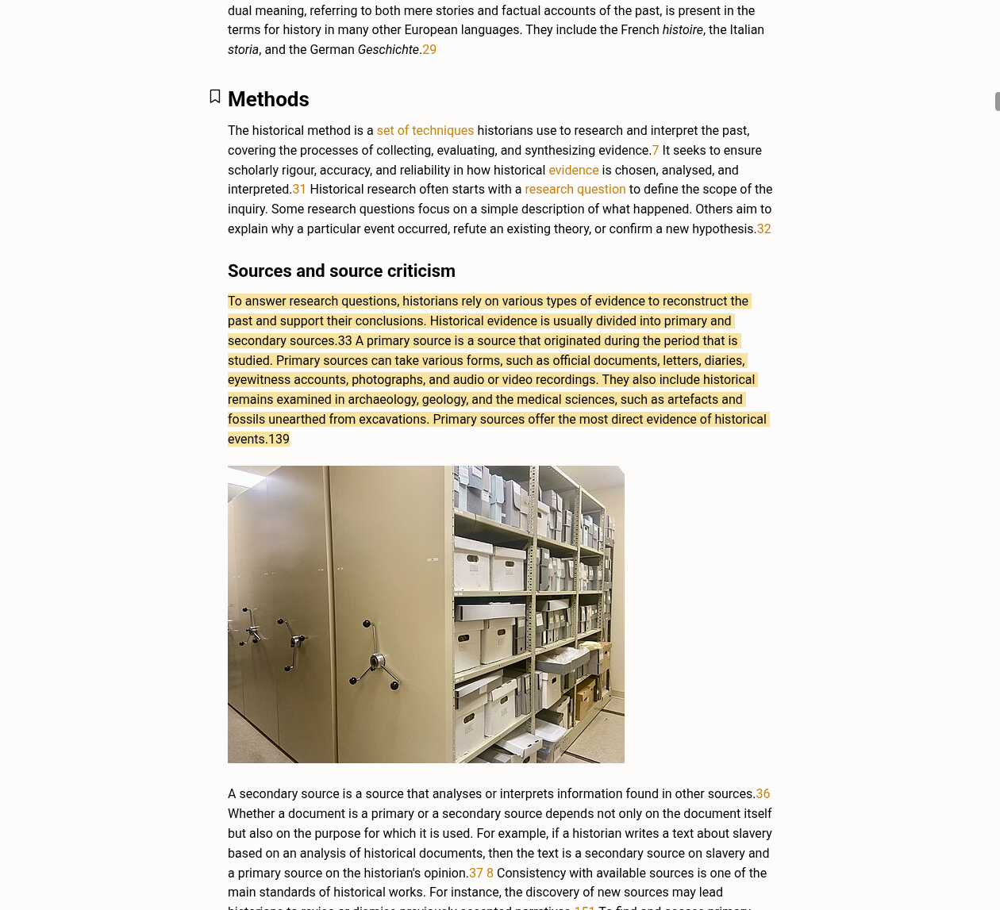
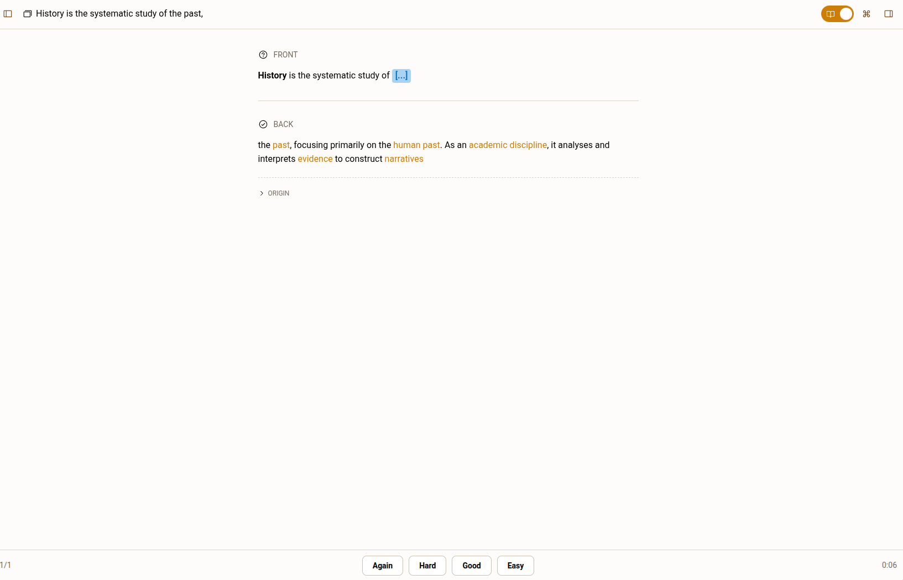

  

<h1 align="center">Amber</h1>

  Distraction-free, minimalist yet powerful incremental learning — free and open source.

  <a href="https://amberapp.dev/">Website</a> ·
  <a href="https://discord.gg/krb7uWTQjt">Discord</a>

---

## Screenshots

  <kbd></kbd>
   
  <em>Amber — main view</em>

  <kbd></kbd>
   
  <em>Amber — minimalist view</em>

  <kbd></kbd>
   
  <em>Amber — study mode</em>

---

## Why Amber

- **Distraction-free by design**: a minimalist interface that keeps your material front and center, and everything else out of the way.
- **Built around incremental learning**: a real incremental reading flow: import material, extract what matters, turn extracts into cards, and let the priority queue decide what you see next.
- **Bring your own material**: import PDFs, articles, and web pages, and work through them at your own pace.
- **Designed by an incremental learning practitioner**: the workflow comes from actually using the method daily, not from guessing at it.
- **Free, open source, and multiplatform**: runs on Linux, Windows, macOS, and Android, with your data staying yours.
